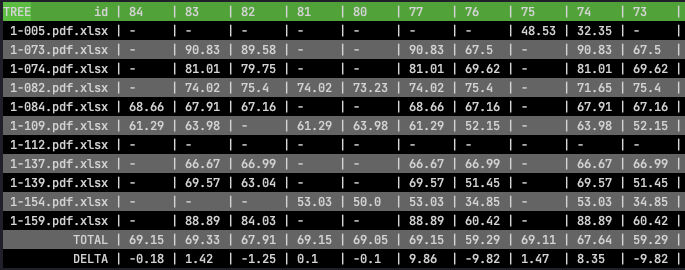

Managing experiment
---
Often, while tuning the rules and changing the settings, we want to see how it effects the output in
comparison with the previous changes. This utility provides utilities to manage your experiments.


Usage
---
By default, when you run `gen_report` from `evaluating` module, the output will be registered as new
experiment result.

To show the statistic on how the current settings compare to the previous ones, run

```python
from document_reader.utils import dr

dr.show_statistic()
# By default, `show_statistic` will show all the three statistic for `OCR`, `para` and `tree`

# To show static for a single stage, `tree` for example, call:
dr.show_statistic('tree')

# for `tree`, and `para`
dr.show_statistic(['tree', 'para'])
```

The output will appear in the command line:

Convention:

- Name of the metric appear on the top left conner in uppercase, `TREE` in this case
- The first column is name of the file
- The first row is the index of the experiment(auto increase by one each time)
- The last two rows show the `TOTAL`(overall accuracy) and `DELTA`(the different in compare to the
  previous experiment)
- File missing in any experiment will have empty result(empty cell)
- File has the same result as previous experiment will be mark by a hyphen (`-`)
